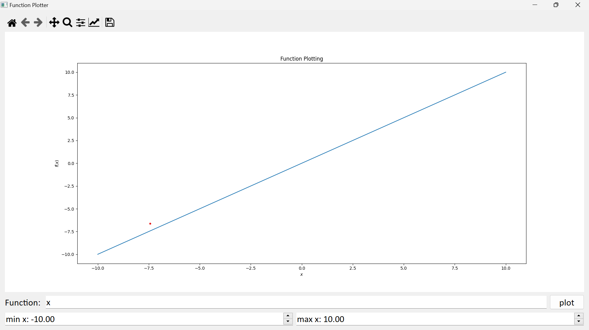
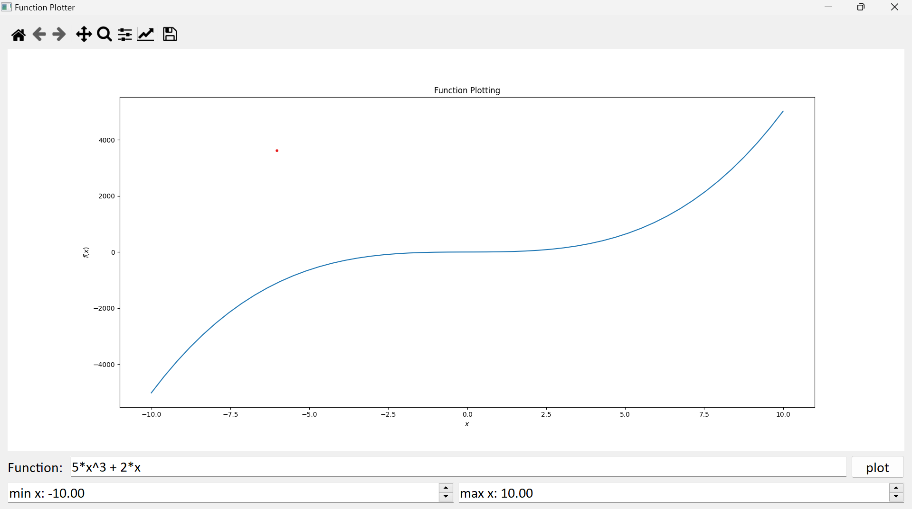
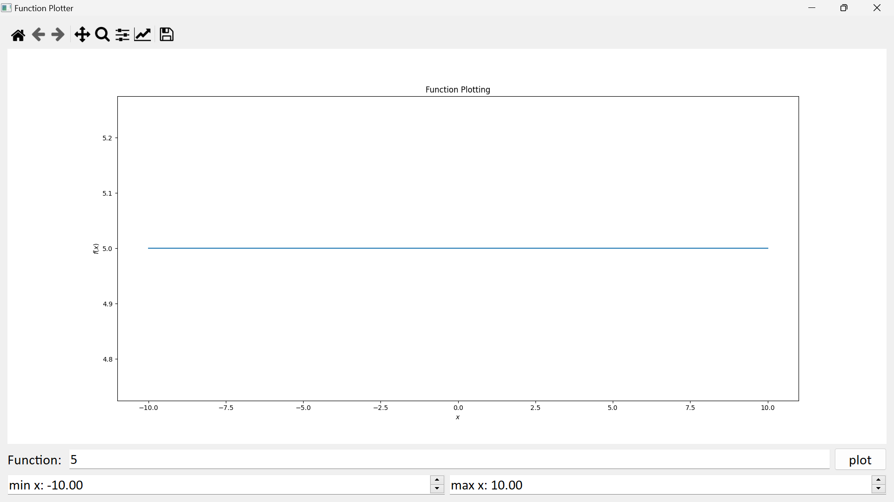
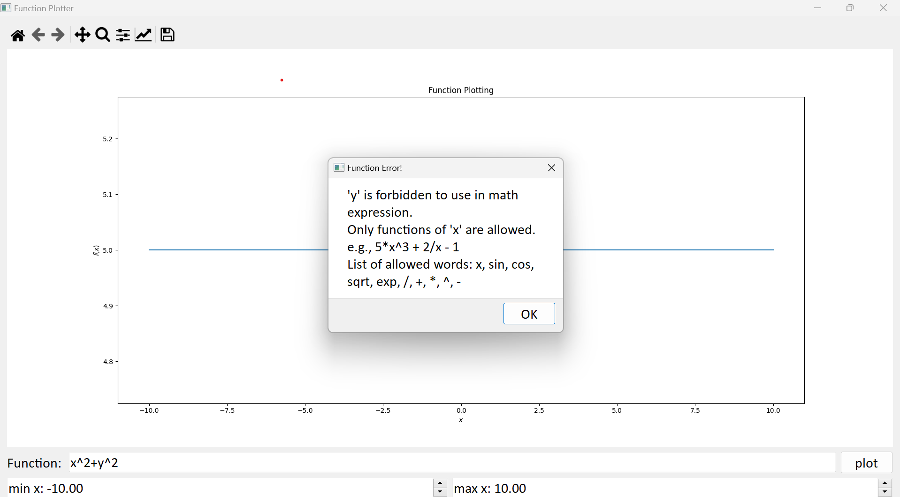
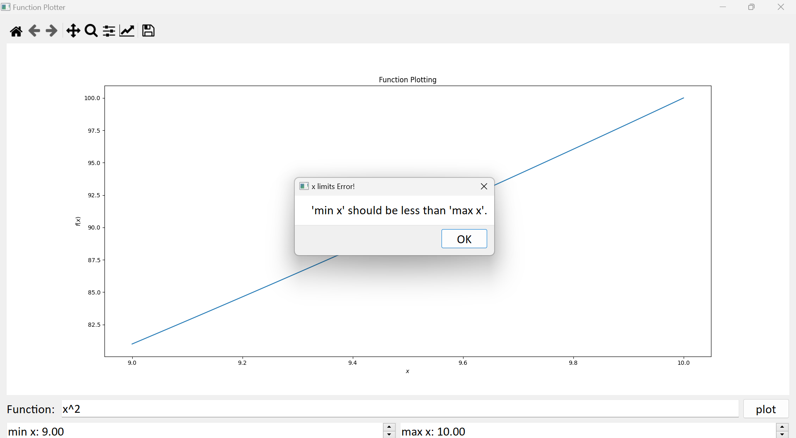
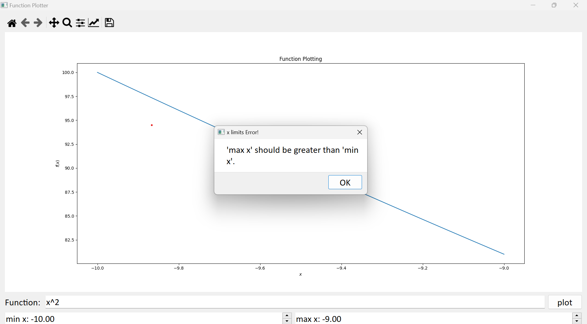

# Function Plotter

# Introduction

## Python GUI program that plots arbitrary user-entered math function using [*PySide2*](https://pypi.org/project/PySide2/) & [*matplotlib*](https://matplotlib.org/stable/contents.html) and supported with some GUI tests using [*pytest-qt*](https://pytest-qt.readthedocs.io/en/4.0.2/index.html)

## Requirments
* App requirments 
```python
pip install PySide2
pip install Numpy
pip install Matplotlib
pip install OS-Sys
```
* Testing Requirments
```python
pip install Pytest
pip install Pytest-Qt
```

## Usage

* Run [function_plotter.py](function_plotter.py) file.
```python
python function_plotter.py
```
* In case of testing, run [program_test.py](program_test.py) file.
```python
pytest program_test.py
```

### Working Examples







### Wrong Examples






